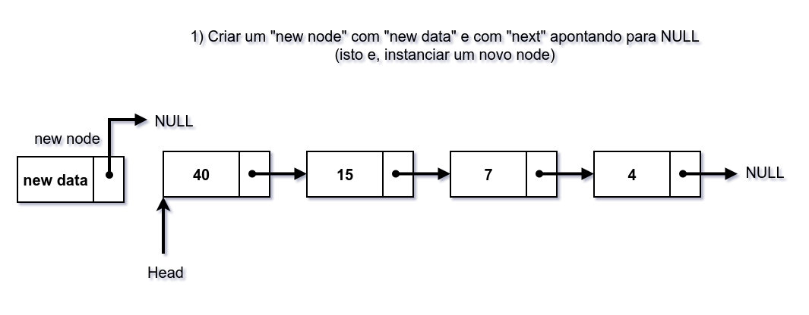
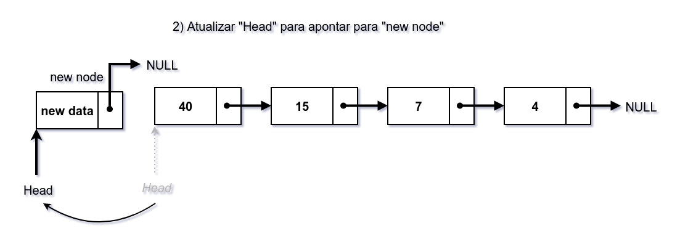
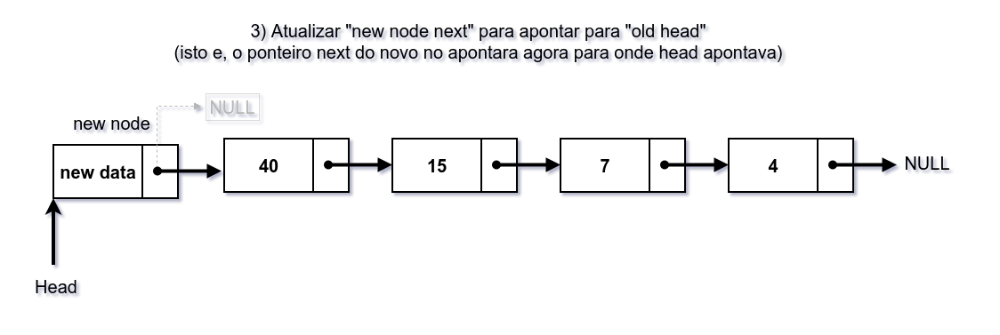

# Linked List Facts

## Comparando Linked List, Arrays e Dynamic Arrays


| Parameter               | Linked List | Array                                                            | Dynamic Array                                             |
|:------------------------|:------------|:-----------------------------------------------------------------|:----------------------------------------------------------|
| indexar | O(n)      | O(1)                                                             | O(1)                                                      |
| insert/delete no começo | O(1) | O(n) se o array não está cheio (por causa do shift de elementos) | O(n)                                                      |
| insert no fim           | O(n) | O(1) se o array não está cheio                                   | O(1) se o array não está cheio<br/> O(n) se o array está cheio |
| delete no fim           | O(n) | O(1)                                                             | O(n)                                                      |
| insert no meio          | O(n) | O(n) se o array não está cheio (por causa do shift de elementos) | O(n)                                                      |
| delete no meio          | O(n) | O(n) se o array não está cheio (por causa do shift de elementos)  | O(n)                                                      |
| memória desperdiçada    | O(n) (para os ponteiros)| 0                                                                | O(n)                                                      |

## Single Linked List


https://github.com/osdeving/java-problems/blob/927aa6d5d3c08378a2f8f90357ddf5ada62e3f00/src/main/java/br/com/willams/datastructures/linkedlist/ListNode.java#L3-L6


```java
public class ListNode {
    int data;
    ListNode next;
}
```

## Operações básicas

- Percorrer
- Inserir
- Remover

Uma vez que temos um ponteiro para o início da lista, basta acessar esse ponteiro, obter a informação ali presente e então repetir o processo para o próximo ponteiro.

A inserção pode ocorrer no início, no meio ou no fim.

## Inserção no Início








