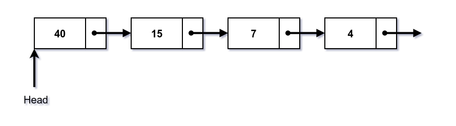

# Linked List Facts

## Comparando Linked List, Arrays e Dynamic Arrays

| Parameter               | Linked List | Array                                                            | Dynamic Array                                             |
|:------------------------|:------------|:-----------------------------------------------------------------|:----------------------------------------------------------|
| indexar | O(n)      | O(1)                                                             | O(1)                                                      |
| insert/delete no começo | O(1) | O(n) se o array não está cheio (por causa do shift de elementos) | O(n)                                                      |
| insert no fim           | O(n) | O(1) se o array não está cheio                                   | O(1) se o array não está cheio  O(n) se o array está cheio |
| delete no fim           | O(n) | O(1)                                                             | O(n)                                                      |
| insert no meio          | O(n) | O(n) se o array não está cheio (por causa do shift de elementos) | O(n)                                                      |
| delete no meio          | O(n) | O(n) se o array não está cheio (por causa do shift de elementos)  | O(n)                                                      |
| memória desperdiçada    | O(n) (para os ponteiros)| 0                                                                | O(n)                                                      |

## Single Linked List

