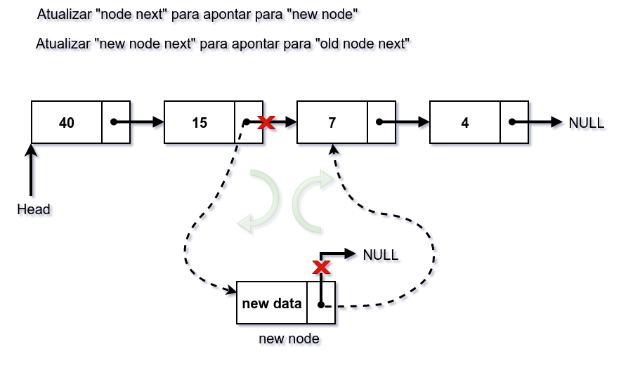

# Linked List Facts

## Comparando Linked List, Arrays e Dynamic Arrays


| Parameter               | Linked List | Array                                                            | Dynamic Array                                             |
|:------------------------|:------------|:-----------------------------------------------------------------|:----------------------------------------------------------|
| indexar | O(n)      | O(1)                                                             | O(1)                                                      |
| insert/delete no começo | O(1) | O(n) se o array não está cheio (por causa do shift de elementos) | O(n)                                                      |
| insert no fim           | O(n) | O(1) se o array não está cheio                                   | O(1) se o array não está cheio<br/> O(n) se o array está cheio |
| delete no fim           | O(n) | O(1)                                                             | O(n)                                                      |
| insert no meio          | O(n) | O(n) se o array não está cheio (por causa do shift de elementos) | O(n)                                                      |
| delete no meio          | O(n) | O(n) se o array não está cheio (por causa do shift de elementos)  | O(n)                                                      |
| memória desperdiçada    | O(n) (para os ponteiros)| 0                                                                | O(n)                                                      |

## Single Linked List


Em java podemos representar um Node da seguinte forma:

https://github.com/osdeving/java-problems/blob/927aa6d5d3c08378a2f8f90357ddf5ada62e3f00/src/main/java/br/com/willams/datastructures/linkedlist/ListNode.java#L3-L6

A lista, por sua vez, pode ser representada assim:

```java
public class SingleLinkedList {
    ListNode head;
    
    ... métodos da lista 
}
```

> **Observação**: _Embora os exemplos estejam em Java, para evitar distrações, de início não teremos encapsulamento ou outras boas práticas de Linguagem Orientada a Objetos. Isso vai permitir reaproveitar o código em várias linguagens com sintaxe C-Like (JavaScript, C e C++ principalmente) com poucas modificações_.

## Operações básicas

- Percorrer
- Inserir
- Remover

### Percorrer a Lista

Para percorrer a lista, uma vez que temos um ponteiro para o início da lista, basta acessar esse ponteiro, obter a informação ali presente e então repetir o processo para o próximo ponteiro.

Abaixo temos um exemplo para contar os elementos da lista. Ou seja, percorrer a lista até que o ponteiro next seja null.

https://github.com/osdeving/java-problems/blob/07fd95cab4225404b7318691bdcf74a2213de8ad/src/main/java/br/com/willams/datastructures/linkedlist/SingleLinkedList.java#L8-L18

### Inserindo nós na Lista

A inserção pode ocorrer:

- No Início
- No Meio
- No Fim.

#### Inserção no Início

Criando um novo nó


Atualizando Head


Atualizando next do novo nó


### Inserção no Final

Uma vez que você criou um novo nó (como no exemplo anterior), basta conectar o ponteiro "next" do último nó para o novo nó. É importante lembrar que só conseguimos alcançar o último nó percorrendo a lista até que "node.next" aponte para null. Podemos otimizar esse processo criando um ponteiro que sempre aponta para o último nó, mas por enquanto vamos manter o cenário mais simples.


### Inserção no Meio

Para inserir no meio da lista é necessário quebrar a ligação e reajustar os ponteiros para o novo nó. O ponteiro next do node deve apontar para o novo nó (rompendo a ligação com o  resto da lista) e o ponteiro next do novo nó de apontar para o antigo node next (ligando novamente o resto da lista, dessa vez no novo nó).

A imagem abaixo mostra visualmente o processo. 




### Inserção: Show me the code!

Segue abaixo o código de inserção. Note que para melhor entendimento você pode criar um método para cada tipo de inserção (início, meio e fim).

https://github.com/osdeving/java-problems/blob/d8ab62495f4de9d7acd963d7c5cf2917fb106d73/src/main/java/br/com/willams/datastructures/linkedlist/SingleLinkedList.java#L20-L51

### Deletando nós da Lista

A remoção, assim como a inserção, pode ocorrer:

- No Início
- No Meio
- No Fim.

#### Deletando o primeiro nó da Lista


### Remoção: Show me the code!

Segue abaixo o código de remoção.

https://github.com/osdeving/java-problems/blob/49bf5e089baf401a28fb3b6adf1287920db0a65e/src/main/java/br/com/willams/datastructures/linkedlist/SingleLinkedList.java#L63-L88

